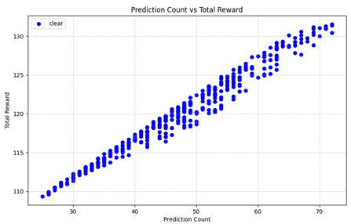

# DQN 알고리즘과 Unity 3D Environment 연동 프로젝트

## 📚 **프로젝트 개요**
이 프로젝트는 **DQN 알고리즘**을 활용하여 **Unity 3D Environment**와 **Python** 간의 통신을 통해 강화학습을 구현한 프로젝트입니다.
Python과 Unity간의 TCP 통신을 이용해 구현되었습니다.

## 🔧 **개발 환경**
- **Unity 버전**: 2021.3.45f1
- **Python 버전**: 3.10.14
- **CUDA 버전**: 12.2
- **CuDNN 버전**: 8

---

## 🎯 **프로젝트 목적**
- Unity와 Python의 통신을 통해 **강화학습의 구현 방법을 조사**하고, 이를 활용해 DQN 알고리즘을 적용하여 에이전트의 행동 학습을 실험합니다.

---

## 📘 **강화학습 개요**

### 💡 **강화학습의 주요 개념**
- **Agent**: 환경과 상호작용하며 최적의 행동을 찾는 주체
- **Environment**: Agent가 상호작용하는 환경으로, 보상과 상태가 변동됨
- **State**: Agent가 관찰할 수 있는 환경의 정보
- **Action**: Agent가 현재 상태에서 수행할 수 있는 행동
- **Reward**: 행동의 결과로 주어지는 보상 (보상이 클수록 해당 행동을 더 선호하도록 학습)

### 🧠 **강화학습의 학습 원리**
- **탐험(Exploration)과 이용(Exploitation)**을 통해 최적의 행동을 학습
- 탐험: 새로운 행동을 시도하여 보상을 확인
- 이용: 현재까지 학습된 지식을 바탕으로 최적의 행동을 선택

### 🔥 **DQN 알고리즘**
- 논문 **"Playing Atari with Deep Reinforcement Learning"**에서 소개된 알고리즘
- **Q-Learning의 신경망 근사화**를 통해 State-Action 값을 신경망으로 근사화
- **Replay Buffer**: 이전에 수행한 행동을 저장하여 샘플링, Agent의 편향된 학습을 방지
- **Target Network**: 일정 주기마다 학습 중인 네트워크의 가중치를 복사하여 Q값 업데이트의 안정성을 높임

---

## ⚙️ **강화학습 구현 방법**

### 📐 **1. Unity를 활용한 환경 설정**
- **Environment**: Unity를 통해 에이전트와 환경을 제작
- **Agent**: 빨간색 구체로 설정하여 물리 엔진과 연동
- **목표**: 빨간색 정육면체에 에이전트가 충돌하는 것을 목표로 설정
- **보상 정책**:
  - 빨간색 정육면체에 가까워질수록 높은 보상
  - 빨간색 정육면체와 충돌하면 최대 보상 지급
  - Forward, Backward, Right, Left Action 추가
- **통신**: TCP 통신으로 Python으로부터 Action 명령을 받아 환경 업데이트

### 🖥️ **2. Python을 활용한 딥러닝 강화학습 설정**
- **프레임워크**: TensorFlow로 DQN 알고리즘 구현
- **입력 데이터**: 2개의 좌표 (x, z)를 입력으로 받아 다음 행동 예측
- **출력**: 4개의 Action으로 출력 (Forward, Backward, Left, Right)
- **Epsilon**: 탐험 비율을 조정하여 최적의 학습을 유도
- **통신**: TCP 통신을 통해 Unity로부터 State와 Reward를 수신하고, Action을 Unity로 전달

### 📄 **3. 플로우 차트**

  

---

## 📈 **실행 방법**

1. **강화학습 결과 설정**
    - DQNTest.py 실행 
   - 학습 결과 실행에는 **epsilon 값을 0.0**으로 설정
   - **500번의 게임**을 통해 강화학습 평가
   - 성공 시 몇 번의 움직임을 전달했는지를 저장하는 변수를 추가
   - 결과는 **validation.csv**에 기록

2. **Random_Positions.csv 생성**
   - 모든 모델은 동일한 환경에서 평가해야 함
   - **빨간색 큐브의 위치 500개**를 사전에 CSV 파일로 생성
   - X, Y 좌표를 -35에서 35 사이의 범위로 설정 (GPT를 활용해 500개의 좌표 랜덤 생성)
---

## 📊 **Reawrd 정책 분석**

### 🔍 **DQN 모델 수식 분석**
- **벨만 최적 방정식**을 사용해 Q값을 도출
- 수식: \( Q(s, a) = r + \gamma \max_{a'} Q(s', a') \)
  - \( r \) : 현재 상태의 즉시 보상
  - \( \gamma \) : 감가율, 미래의 보상을 신뢰하는 파라미터
  - \( s' \) : 다음 상태
  - \( a' \) : 가능한 행동 중 최대 Q값을 선택

### 📄 **코드 분석**
- 기존 벨만 최적 방정식에 **에피소드 상태** 추가
- 에피소드가 끝나면 `dones=1`로 설정하여 보상만 반영
- **One-Hot Encoding**으로 현재 Agent가 취한 행동을 변환
- Q값과 Target Q값의 **MSE 오차**를 계산하여 학습

---

## 💡 **Reward 정책 개선 아이디어**

### ⚙️ **문제점 분석**
- 기존 Reward 정책으로 학습된 모델은 에이전트가 빨간색 큐브 앞에서 **앞뒤로 움직이는 문제**가 발생
- 이 문제는 목표에 충돌하기보다는 즉시 보상을 얻기 위해 Agent가 **앞뒤로 움직이는 행동을 학습**하는 데 기인
- 움직임을 기록한 validation.csv를 시각화 한 결과 Clear된 게임중 행동(Action)이 많아질 수록 점수가 높아지는것을 확인

  

### ✍️ **개선 아이디어**
- 기존 Reward에 **행동에 대한 페널티 추가**
- 행동(Action)이 많아질수록 Reward에 페널티를 부여하여 **최소한의 행동으로 목표에 도달**하도록 정책 변경

### 📉 **정책 개선 후 결과**
- **MyCheck.cs에 페널티 코드 추가**: 매 스텝마다 페널티가 선형 증가하도록 설정
- **결과 비교**
  - 기존 정책: **425개의 게임 Clear**
  - 개선 정책: **500개의 게임을 모두 Clear**

- **성능 향상**: Total Reward가 움직임이 많을수록 감소하여, Agent가 안정적으로 게임을 Clear하는 모습을 보임

  

---

## ✨ **결론**
- **DQN 알고리즘과 Unity 3D 환경 연동**을 통해 강화학습을 성공적으로 구현하였으며, 기존 Reward 정책의 한계를 극복하기 위해 **행동 페널티**를 추가하여 성능을 개선했습니다.

---

